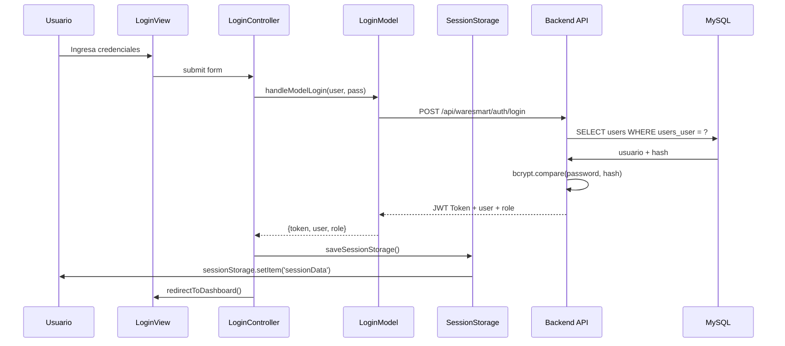
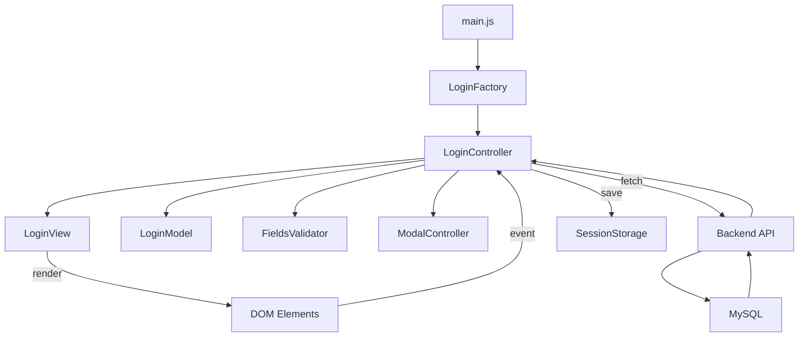

# WARESmart - Memory Bank

## 📋 Información General del Proyecto

**Nombre del Proyecto:** WARESmart  
**Tipo:** Aplicación de Control de Inventarios (Frontend + Backend)  
**Stack Principal:** Node.js (Express), MySQL, Vite, Vanilla JS, TailwindCSS  
**Autor:** César López  
**Descripción:** Componentes frontend reutilizables para una aplicación de gestión de inventarios.

---

## 🏗️ Estructura del Proyecto

```
frontend_components/
├── backend/                    # Servidor Node.js + Express
│   ├── config/
│   │   └── db.js              # Pool de conexiones MySQL
│   ├── controllers/
│   │   ├── authentication/
│   │   │   └── controller.js # Lógica de auth (login, register)
│   │   └── users/
│   │       └── controller.js  # CRUD de usuarios
│   ├── middlewares/
│   │   └── auth.js            # Middleware JWT
│   ├── routes/
│   │   ├── authRoutes.js      # Rutas de autenticación
│   │   └── rutas.js          # Enrutador principal
│   ├── services/
│   │   ├── authentication/
│   │   │   └── service.js    # Lógica de negocio auth
│   │   └── users/
│   │       └── service.js    # Lógica de negocio usuarios
│   ├── server.js             # Punto de entrada del servidor
│   └── package.json
│
├── vite-components/           # Frontend Vite
│   ├── src/
│   │   ├── components/
│   │   │   ├── LoginForm/    # Componente Login (MVC)
│   │   │   │   ├── controller/loginController.js
│   │   │   │   ├── model/loginModel.js
│   │   │   │   ├── view/loginView.js
│   │   │   │   └── icons/svg_icons.js
│   │   │   ├── ModalError/   # Componente Modal (MVC)
│   │   │   │   ├── controller/modalController.js
│   │   │   │   ├── model/modalModel.js
│   │   │   │   ├── view/modalView.js
│   │   │   │   └── icons/modal_icons.js
│   │   │   ├── Storage/
│   │   │   │   └── storage.js # SessionStorage wrapper
│   │   │   └── Validator/
│   │   │       └── fieldsValidator.js # Validador de campos
│   │   ├── factory/
│   │   │   ├── login_factory.js  # Factory Login
│   │   │   └── modal_factory.js # Factory Modal
│   │   ├── main.js            # Entry point
│   │   └── style.css          # Estilos globales + Tailwind
│   ├── dacs/                 # Plantillas DACS
│   │   ├── dacTemplate.dac    # Template scaffold componentes
│   │   ├── mvc_pattern.dac    # Guía patrón MVC
│   │   └── js_functions.dac  # Guía estilo JS
│   ├── index.html
│   ├── vite.config.ts
│   └── package.json
│
├── docs/
│   └── log.md                # Bitácora de desarrollo
└── .gitignore
```

---

## 🔄 Flujo del Proyecto (Contexto Principal)

### Flujo de Autenticación (Login)



### Flujo de Datos (MVC)



---

## 🎯 Patrones de Diseño

### 1. MVC (Model-View-Controller) - Frontend

Cada componente sigue esta estructura:

- **Model:** Comunicación con APIs, retorna datos puros
- **View:** Renderizado HTML, manejo del DOM
- **Controller:** Orquestación, eventos, coordinación Model-View

**Archivos requeridos por componente:**

- `{Componente}Model.js`
- `{Componente}View.js`
- `{Componente}Controller.js`

### 2. Factory Pattern

**[`login_factory.js`](vite-components/src/factory/login_factory.js:11):**

```javascript
export class LoginFactory {
  static loginComponent() {
    // Instancia y ensambla el componente completo
    const { element: modalElement, controller: modalController } =
      ModalFactory.modalComponent();
    const view = new LoginView(icons);
    const model = new LoginModel();
    // ...
    return { form: htmlLoginForm, modal: modalElement };
  }
}
```

### 3. Patrón de Capas - Backend

```
Routes → Controllers → Services → Database
```

**[`rutas.js`](backend/routes/rutas.js:10):**

- Rutas (Routes) → `/api/waresmart/auth`, `/api/waresmart/users`
- Controladores (Controllers) → Lógica de request/response
- Servicios (Services) → Lógica de negocio pura
- Database → MySQL con connection pooling

### 4. Singleton Pattern - SessionStorage

**[`storage.js`](vite-components/src/components/Storage/storage.js:3):**

- Una única instancia del objeto `sessionData`
- Getters/setters para token, user, role

---

## 🔧 Configuración y Variables de Entorno

### Backend (.env.template)

```env
DB_HOST: "Dirección IP de la base de datos"
DB_USER: "usuario"
DB_PASSWORD: "contraseña"
DB_NAME: "Nombre de la base de datos"
JWT_SECRET: "Semilla para generar los tokens"
```

### Frontend (Vite)

```javascript
// Variables de entorno en vite-components/
import.meta.env.VITE_API_URL; // URL del backend
import.meta.env.VITE_FORGOTPASS_LINK; // URL recuperación contraseña
```

---

## 📡 Endpoints del Backend

### Autenticación

| Método | Endpoint                           | Descripción         | Autenticado |
| ------ | ---------------------------------- | ------------------- | ----------- |
| POST   | `/api/waresmart/auth/login`        | Inicio de sesión    | ❌          |
| POST   | `/api/waresmart/auth/register`     | Registro de usuario | ❌          |
| GET    | `/api/waresmart/auth/verify-token` | Verificar token     | ✅          |

### Usuarios

| Método | Endpoint                        | Descripción                | Autenticado |
| ------ | ------------------------------- | -------------------------- | ----------- |
| POST   | `/api/waresmart/users/get/all`  | Obtener todos los usuarios | ✅          |
| POST   | `/api/waresmart/users/get/byId` | Obtener usuario por ID     | ✅          |
| POST   | `/api/waresmart/users/upd/byId` | Actualizar usuario         | ✅          |
| POST   | `/api/waresmart/users/del/byId` | Eliminar usuario           | ✅          |

---

## 🔐 Lógica de Autenticación

### Login Flow

1. **Usuario** envía username y password
2. **Controller** valida campos localmente
3. **Model** hace fetch al endpoint `/login`
4. **Backend Service** busca usuario en MySQL
5. **Backend** compara contraseña con bcrypt
6. **Backend** genera JWT token (expira en 30 minutos)
7. **Frontend** guarda token en sessionStorage
8. **Redirect** al dashboard

### JWT

- **Expiración:** 30 minutos
- **Payload:** `{ userId, username, role }`
- **Header:** `Authorization: Bearer <token>`

---

## ✅ Validaciones

### Frontend - [`fieldsValidator.js`](vite-components/src/components/Validator/fieldsValidator.js:18)

**Usuario:**

- Mínimo 4 caracteres
- Solo letras (incluye acentos español y ñ/Ñ)
- Sin números ni caracteres especiales

**Contraseña:**

- Mínimo 6 caracteres
- Al menos una mayúscula (comentado actualmente)
- Al menos un caracter especial (`@#!$_*&`) O un número
- Sin acentos ni puntos

### Backend

- Validación de entrada en controladores
- Validación de ID como entero positivo
- Validación de datos de actualización

---

## 🧩 Componentes Existentes

### 1. LoginForm

**Propósito:** Formulario de inicio de sesión

**Funcionalidades:**

- Toggle visibilidad contraseña
- Validación en tiempo real (blur)
- Link recuperación contraseña (env variable)
- Comunicación con backend
- Guardado de sesión en sessionStorage
- Modal de error en login fallido

**Archivos:**

- [`loginController.js`](vite-components/src/components/LoginForm/controller/loginController.js)
- [`loginView.js`](vite-components/src/components/LoginForm/view/loginView.js)
- [`loginModel.js`](vite-components/src/components/LoginForm/model/loginModel.js)

### 2. ModalError

**Propósito:** Mostrar errores de autenticación

**Funcionalidades:**

- Mostrar/ocultar modal
- Cerrar con botón, overlay o tecla ESC
- Accessibility (ARIA)

**Archivos:**

- [`modalController.js`](vite-components/src/components/ModalError/controller/modalController.js)
- [`modalView.js`](vite-components/src/components/ModalError/view/modalView.js)
- [`modalModel.js`](vite-components/src/components/ModalError/model/modalModel.js)

### 3. SessionStorage

**Propósito:** Gestionar datos de sesión

**Métodos:**

- `Token` (getter/setter)
- `UserName` (getter/setter)
- `Role` (getter/setter)
- `saveSessionStorage()`
- `loadSessionStorage()`
- `clearSession()`

---

## 📦 Dependencias

### Backend

```json
{
  "bcrypt": "^6.0.0",
  "cors": "^2.8.6",
  "dotenv": "^17.3.1",
  "express": "^5.2.1",
  "jsonwebtoken": "^9.0.3",
  "mysql2": "^3.17.2"
}
```

### Frontend

```json
{
  "tailwindcss": "^4.x",
  "@tailwindcss/vite": "latest",
  "vite": "latest"
}
```

---

## 📝 Convenciones de Código

### Nomenclatura

- **Clases:** PascalCase (`LoginController`, `ModalView`)
- **Variables DOM:** Prefijo `$` (`this.$userInput`, `this.$form`)
- **Métodos:** Verbo + camelCase (`handleLogin`, `renderForm`)
- **Archivos:** PascalCase + descripción (`loginController.js`)

### JSDoc (Obligatorio)

```javascript
/**
 * @method nombreDelMetodo
 * @description Descripción breve de lo que hace el método.
 * @param {tipo} nombre - Descripción del parámetro.
 * @returns {tipo} - Descripción del retorno.
 * @throws {tipo} - Descripción de errores posibles.
 * @example // Ejemplo de uso
 */
```

### Estructura MVC por Archivo

**Model:**

```javascript
export class LoginModel {
  async login(username, password) {
    // Fetch API - NO manipula DOM
  }
}
```

**View:**

```javascript
export class LoginView {
  renderLoginForm() {
    // Retorna HTML string - NO lógica de negocio
  }
}
```

**Controller:**

```javascript
export class LoginController {
  constructor(view, model) {
    this.view = view;
    this.model = model;
  }
}
```

---

## 🔄 Estado Actual del Proyecto (según log.md)

### Completado ✅

- [x] Setup proyecto Vite + TailwindCSS
- [x] Componente LoginForm completo (MVC)
- [x] Toggle password
- [x] Link recuperación contraseña
- [x] Validaciones de campos
- [x] Backend Express con autenticación JWT
- [x] Refactorización backend (capas)
- [x] Modelo para comunicación con API
- [x] Factory pattern para componentes

### Pendiente/In Progress ⏳

- [ ] Submit logic completo (redirección al dashboard)
- [ ] Testing en navegador del login completo

---

## 🚀 Próximos Pasos Sugeridos

1. **Completar flujo de login:**
   - Descomentar `redirectToDashboard()` en [`loginController.js:222`](vite-components/src/components/LoginForm/controller/loginController.js:222)
   - Crear página dashboard

2. **Agregar más componentes:**
   - UserTable (listado de usuarios)
   - InventoryTable (inventario)
   - NavBar

3. **Mejorar seguridad:**
   - Implementar refresh tokens
   - Rate limiting
   - Validación más robusta

4. **Testing:**
   - Jest para backend
   - Vitest para frontend

---

## 📚 Recursos DACS (Templates para IA)

Los archivos en [`vite-components/dacs/`](vite-components/dacs/) guían a agentes IA:

- **dacTemplate.dac:** Scaffold de componentes MVC
- **mvc_pattern.dac:** Guía de implementación MVC
- **js_functions.dac:** Estilo y convenciones JS

---

_Última actualización: 2026-02-24_
_Documento generado automáticamente_
